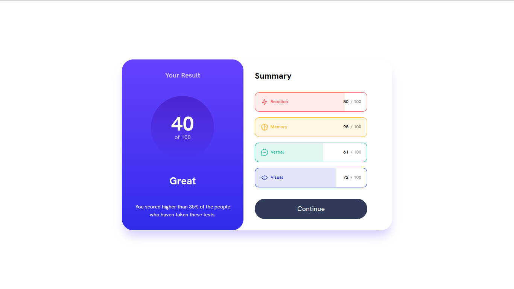

# Frontend Mentor - Results summary component solution

This is a solution to the [Results summary component challenge on Frontend Mentor](https://www.frontendmentor.io/challenges/results-summary-component-CE_K6s0maV). Frontend Mentor challenges help you improve your coding skills by building realistic projects.

## Table of contents

- [Overview](#overview)
  - [The challenge](#the-challenge)
  - [Screenshot](#screenshot)
  - [Links](#links)
- [My process](#my-process)
  - [Built with](#built-with)
  - [What I learned](#what-i-learned)
  - [Continued development](#continued-development)
- [Author](#author)

## Overview

### The challenge

Users should be able to:

- View the optimal layout for the interface depending on their device's screen size
- See hover and focus states for all interactive elements on the page

### Screenshot



### Links

- Solution URL: [https://www.frontendmentor.io/solutions/results-sumary-using-react-tailwind-css-nextjs-framermotion-KcWF1yjz5Y](https://www.frontendmentor.io/solutions/results-sumary-using-react-tailwind-css-nextjs-framermotion-KcWF1yjz5Y)
- Live Site URL: [https://results-summary-delta-three.vercel.app](https://results-summary-delta-three.vercel.app)

## My process

### Built with

- Flexbox
- CSS Grid
- Mobile-first workflow
- [React](https://reactjs.org/) - JS library
- [Next.js](https://nextjs.org/) - React framework
- [Tailwind CSS](https://tailwindcss.com) - CSS framework
- [Framer Motion](https://www.framer.com/motion/) - Animation Library

### What I learned

I use this project to learn about react and framer motion animations, using the _motion_ component and applying the properties _initial_, _animate_, _transition_, etc.

```html
<motion.div initial={{ x: 400 }} animate={{ x: 0 }} transition={{ delay: delay }}>
            ...
</motion.div>
```

with that, I improve my use of Tailwind CSS classes

```html
<section className="flex flex-col gap-5 p-10 md:w-[50%]"></section>
```

### Continued development

I want continue improving my skills in the tecnologies that I was using in this project

## Author

- Frontend Mentor - [@kiddhermez](https://www.frontendmentor.io/profile/kiddhermez)
